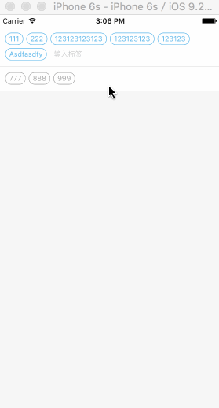

# MKTagEditor

A tag editor like wechat

## Functions

* show and edit mode you can choice by set `editable`
* you can custome some view attr, like `tagSpace`, `tagFontSize`, `padding`, eg.
* you can custome tag style by rewrite delegate funcions

```obj-c
// MKTagView can edit, normal style
- (void)mkTagView:(MKTagView *)tagview editableStyle:(MKTagLabel *)tagLabel;
// MKTagView can edit, editing style
- (void)mkTagView:(MKTagView *)tagview editingStyle:(MKTagLabel *)tagLabel;
// MKTagView can edit, selected style
- (void)mkTagView:(MKTagView *)tagview editSelectedStyle:(MKTagLabel *)tagLabel;
// MKTagView can't edit, normal style
- (void)mkTagView:(MKTagView *)tagview showStyle:(MKTagLabel *)tagLabel;
// MKTagView can't edit, selected style
- (void)mkTagView:(MKTagView *)tagview showSelectedStyle:(MKTagLabel *)tagLabel;

```

* if you want two editors data linkage, you can write delegate Functions

```obj-c
// tagview size changed
- (void)mkTagView:(MKTagView *)tagview sizeChange:(CGRect)newSize;
// onselect tag, use tagLabel.style to judge label status
- (void)mkTagView:(MKTagView *)tagview onSelect:(MKTagLabel *)tagLabel;
// onremove a tag from tag view
- (void)mkTagView:(MKTagView *)tagview onRemove:(MKTagLabel *)tagLabel;
```

## Effect

